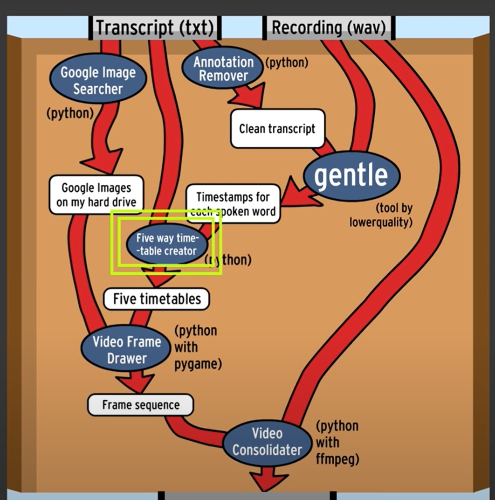

# Research Links

Work on gathering some research related to the topics discusses in the last client meeting. Will discuss our findings during the next team meeting (Oct 3rd, 2022).

### [Blender/Python Animation aproach (Ashish Jha)](https://www.youtube.com/watch?v=UmhoCumme0o)

- uses python for automated speech-to-text. 
- Parses a sentence for vowel phonemes. Sets an angle associated with said vowel phonemes
- **Pros**  
    - very simple
    - free and open source
- **cons**
    - Script requires blender.
    - The wrong tool for the job, blender is a tool made for graphic artists, not plucky CS majors. 
    - requires adequate knowledge of blender. 

 ### [Carykh's approach to animation](https://www.youtube.com/watch?v=y3B8YqeLCpY)
*Edouard already researched this so I'm not going to go too in-depth.*
- uses multiple timetables to communicate emotion, pose, topic, phoneme, and paragraph. 
- uses a phoneme library called gentle 

### [Adobe Animate](https://www.youtube.com/watch?v=3pjPJ1YI3GE) 
*Veronica touched on this but I'll put it here anyways* 
- Uses a visemes template with images for special phonemes 
- consolidate as a symbol, do more weird animate stuff
- use a source audio file text, Animate will do the legwork from there. 
- **Pros**
    - is simple to use   
- **Cons**
    - requires adobe software, which costs money. 
    - traditionally must be configured by hand.

### [3d Lip-sync with iclone](https://www.youtube.com/watch?v=g-Z6a9xP474)
 - Uses a drag and drop approach to quickly configure animation (This approach alone isn't very good)
 - a supplemented script can be introduced. Using the Align function words can be aligned to the audio file. 
- **Pros**
    - Is simple to use. 
- **Cons**
    - Software costs money
    - Must be configured by hand. 

## The problem with Using animation Software... 
All current solutions require some kind of software environment to configure these animations. Items must be entered through a UI. This poses some problems however because:
 - UI-based automation typically is slow and requires meticulous coding and pixel placement. 
 - a dedicated machine must have the scripts and animation software open 24/7 with no crashing.

**Possible solutions**
 - Code environment to automatically add animations to pre-select 3d models (Likely difficult.)
 - Use screen scraper style application with animation software. (Slow and requires a dedicated machine... just not a good solution)
 - Somehow find a third option? Keep researching. 

**Additional thoughts**
- A vesmes seems like it may be required for any animation approach we make. We'll do well to remember that. 
- Not only will we have to get the voice output from the API, but we will need user text as well. This is so that we can cue the program animations based on a string as well. The only trick with this is that we have to synchronize the string with the audio as well.
- Anything that looks promising is meant more for 3d artists. More work on researching libraries has to be completed at this point.